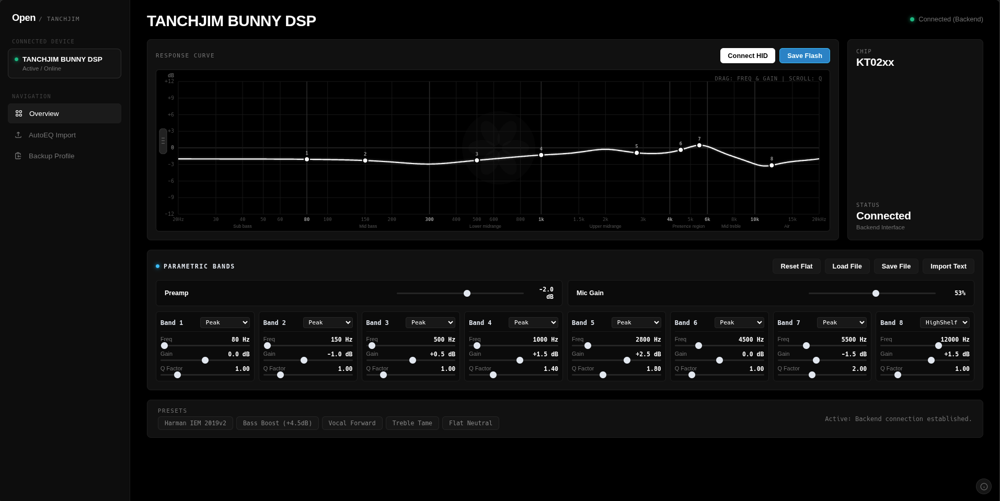

# Tanchjim Bunny DSP Controller for Linux (KT0210)
<p align="center">
  
</p>

<p align="center">
  
  
  
  
</p>

Linux driver, CLI, and WebHID interface to configure the 8-band hardware PEQ on the **Tanchjim Bunny DSP** Type-C In-Ear Monitors / cable (KT Micro KT0210 chip, USB ID `31b2:1112`).

Tanchjim only provides an Android APK to manage their DSP cable. There is no official desktop app for Linux. This project reverse-engineers the vendor USB HID protocol so you can tune your IEMs natively on Linux—either in a browser or through the command line.

You can also **burn your EQ profile straight into the cable's onboard EEPROM flash**. Once saved, the DSP runs your tuning in hardware wherever you plug it in (iPhone 15/16, Android, Mac, Windows, Steam Deck) without needing any background EQ software or drivers.

---

## Features

- **No extra dependencies**: Written using Python 3 standard library. No pip packages or build steps needed.
- **8-band hardware PEQ**: Peak, low shelf, and high shelf biquad filters calculated with RBJ audio cookbook formulas.
- **Hardware EEPROM flashing**: Saves your tuning permanently on the cable so it persists across power cycles and works on other devices with 0% host CPU load.
- **WebHID interface**: Dark-mode equalizer UI inspired by OpenAula. Works natively in Chrome/Brave/Edge over WebHID, or uses a local Python backend in Firefox.
- **Interactive response curve**: Drag nodes for frequency/gain, scroll mouse wheel for Q factor, double-click to reset flat.
- **Digital preamp**: Adjust gain from -12 dB to +12 dB to prevent digital clipping when boosting frequencies.
- **Mic gain control**: Adjusts capture sensitivity for the inline mic via PipeWire, PulseAudio, or ALSA.
- **AutoEQ / Peace import**: Drag and drop or paste `.txt` and `.json` presets from AutoEq, Squiglink, or Peace.
- **Universal distro support**: Automated udev setup script with `--path` flag for Ubuntu, Arch, Fedora, openSUSE, Debian, Void, Alpine, and NixOS.

---

## Quick Start

```bash
# 1. Clone the repo
git clone https://github.com/<your-username>/tanchjim-bunny-dsp.git
cd tanchjim-bunny-dsp

# 2. Grant non-root access and link tanchjim-ctl into PATH
sudo ./install-rules.sh --path

# 3. Launch the web equalizer interface
tanchjim-ctl web

# Or check hardware status in your terminal
tanchjim-ctl status
```

---

## Hardware Flashing: How It Works

The KT0210 DSP chip has two memory banks:
1. **SRAM (volatile)**: Holds whatever filter coefficients are currently processing audio.
2. **EEPROM (flash)**: Onboard non-volatile memory loaded by the chip on power-up.

### Live Tuning vs. Flashing

- **Tuning live**: When you move a slider or apply a preset, parameters write to SRAM registers instantly. You hear the change in real time with no audio dropout.
- **Flashing (`save`)**: When you click **Save to Hardware** (or run `tanchjim-ctl save`), opcode `0x53` burns the current SRAM values into the internal EEPROM page.

### Portability

Because the EQ runs directly on the cable's DSP:
- Unplug the cable and plug it into your **phone (iPhone 15/16, Android), iPad, Mac, Windows laptop, or console**.
- Your custom sound profile plays immediately on the hardware.
- You don't need background EQ apps like Wavelet, Equalizer APO, or SoundID running on your other devices.

### Flashing Commands

```bash
# Apply a tuning preset and flash it permanently
tanchjim-ctl apply harman_iem
tanchjim-ctl save

# Reset all bands to 0 dB flat and flash back to stock
tanchjim-ctl reset
tanchjim-ctl save

# Restore the included factory stock backup
tanchjim-ctl apply presets/stock_backup.json
tanchjim-ctl save
```

---

## Non-Root Access Setup (All Distros)

Linux character devices (`/dev/hidraw*`) are owned by root by default. Installing the udev rules gives your user account permanent read/write access without `sudo`.

### Automated Installer (Recommended)

Run the included installer script with `--path`:
```bash
sudo ./install-rules.sh --path
```

This automatically:
- Detects your Linux distribution and package manager.
- Installs `99-tanchjim.rules` to `/etc/udev/rules.d/`.
- Reloads udev and triggers discovery for connected devices.
- Symlinks `tanchjim-ctl` to `/usr/local/bin` so you can run it from anywhere.

### Manual Distribution Instructions

<details>
<summary><b>Ubuntu / Debian / Pop!_OS / Linux Mint</b></summary>

```bash
sudo cp 99-tanchjim.rules /etc/udev/rules.d/
sudo udevadm control --reload-rules
sudo udevadm trigger --subsystem-match=hidraw
```
</details>

<details>
<summary><b>Arch Linux / Manjaro / EndeavourOS</b></summary>

```bash
sudo cp 99-tanchjim.rules /etc/udev/rules.d/
sudo udevadm control --reload-rules
sudo udevadm trigger --subsystem-match=hidraw
```
</details>

<details>
<summary><b>Fedora / RHEL / CentOS / Rocky Linux</b></summary>

```bash
sudo cp 99-tanchjim.rules /etc/udev/rules.d/
sudo udevadm control --reload-rules
sudo udevadm trigger --subsystem-match=hidraw
```
</details>

<details>
<summary><b>openSUSE (Tumbleweed & Leap)</b></summary>

```bash
sudo cp 99-tanchjim.rules /etc/udev/rules.d/
sudo udevadm control --reload-rules
sudo udevadm trigger --subsystem-match=hidraw
```
</details>

<details>
<summary><b>Void Linux / Alpine / Gentoo (eudev, runit, OpenRC)</b></summary>

```bash
sudo cp 99-tanchjim.rules /etc/udev/rules.d/
sudo udevadm control --reload-rules && sudo udevadm trigger
```
</details>

<details>
<summary><b>NixOS</b></summary>

On NixOS, udev rules are managed declaratively in `/etc/nixos/configuration.nix`. Add this rule:

```nix
services.udev.extraRules = ''
  # Tanchjim Bunny DSP (KT Micro USB ID 31b2:1112)
  SUBSYSTEM=="hidraw", ATTRS{idVendor}=="31b2", ATTRS{idProduct}=="1112", MODE="0666", TAG+="uaccess"
  KERNEL=="hidraw*", ATTRS{idVendor}=="31b2", ATTRS{idProduct}=="1112", MODE="0666", TAG+="uaccess"
'';
```

*(Note: If `services.udev.extraRules` is already defined in your config, append the lines inside your existing quotes rather than defining the attribute twice).*

Then rebuild:
```bash
sudo nixos-rebuild switch
```

To add `tanchjim-ctl` to your user PATH without root:
```bash
./install-rules.sh --path
```
</details>

---

## Web Equalizer Guide

Start the local web controller:
```bash
tanchjim-ctl web
```
This opens `http://localhost:8080` in your default browser.

### How to Use the Interface

1. **Connect**:
   - In Chromium-based browsers (Chrome, Brave, Edge, Chromium), click **Connect** to link directly over WebHID. No backend needed.
   - In Firefox, the UI automatically connects through the local Python backend (`/api/status`, `/api/set-band`).
2. **Frequency Curve Controls**:
   - **Click & Drag**: Move any of the 8 band nodes horizontally for frequency (20 Hz to 20 kHz) and vertically for gain (-12 dB to +12 dB).
   - **Scroll Wheel**: Scroll while hovering over a node to adjust its Q factor.
   - **Double-Click**: Instantly resets that band's gain to 0.0 dB.
3. **Preamp Slider**:
   - When boosting frequencies (e.g. +4 dB bass boost), lower the **Preamp** slider by the same amount (e.g. -4 dB) to prevent digital clipping.
4. **Mic Gain Slider**:
   - Adjusts capture sensitivity for the inline microphone in real time.
5. **Importing Presets**:
   - Click **Load File** or drag-and-drop any `.json` or AutoEQ `.txt` file onto the browser window.
   - Click **Import Text** to paste raw filter text from Squiglink or Peace.
6. **Save to Hardware**:
   - When you like how it sounds, click **Save to Hardware** in the header to burn it to the chip's EEPROM.

---

## CLI Reference & Cheat Sheet

For terminal use, scripts, and hotkeys, `tanchjim-ctl` gives full control over all DSP registers:

| Command | Action | Example |
| :--- | :--- | :--- |
| `status` | Query active mode, slot, preamp, mic gain, and 8 bands | `tanchjim-ctl status` |
| `set-band` | Configure a specific filter band (0 to 7) | `tanchjim-ctl set-band 0 --freq 60 --gain 4.5 --q 0.71 --type LSQ` |
| `set-pregain` | Set digital preamp gain (-12 to +12 dB) | `tanchjim-ctl set-pregain -3.5` |
| `mic-gain` | Inspect or set microphone capture volume | `tanchjim-ctl mic-gain 80%` |
| `apply` | Apply preset by name, file path, or remote URL | `tanchjim-ctl apply harman_iem` |
| `save` | Flash working SRAM curve to hardware EEPROM | `tanchjim-ctl save` |
| `reset` | Zero out all 8 bands to flat 0 dB response | `tanchjim-ctl reset` |
| `get` | Dump active curve to JSON or AutoEQ text format | `tanchjim-ctl get --format autoeq -o curve.txt` |
| `presets` | List bundled presets | `tanchjim-ctl presets` |
| `web` | Launch web equalizer UI | `tanchjim-ctl web --port 8080` |
| `setup-rules` | Inspect and install udev rules for current OS | `tanchjim-ctl setup-rules` |

### Practical CLI Examples

```bash
# Check current hardware state
tanchjim-ctl status

# Apply bundled Harman target and burn to flash
tanchjim-ctl apply harman_iem
tanchjim-ctl save

# Apply tuning directly from a Squiglink or GitHub raw URL
tanchjim-ctl apply https://raw.githubusercontent.com/.../ParametricEQ.txt
tanchjim-ctl save

# Configure a low-shelf bass boost on Band 0
tanchjim-ctl set-band 0 --freq 70 --gain 4.0 --q 0.70 --type LSQ

# Notch out a treble sibilance peak on Band 6
tanchjim-ctl set-band 6 --freq 5800 --gain -3.0 --q 2.50 --type PK

# Attenuate preamp to prevent clipping
tanchjim-ctl set-pregain -4.0

# Set microphone input volume
tanchjim-ctl mic-gain 75%

# Export active hardware tuning to files
tanchjim-ctl get -o my_backup.json
tanchjim-ctl get --format autoeq -o my_backup.txt
```

---

## Preset File Formats

### 1. AutoEQ / Squiglink / Peace Text (`.txt`)

Standard format exported by Squiglink, AutoEq, and Peace:
```text
Preamp: -3.5 dB
Filter 1: ON LSQ Fc 105 Hz Gain 4.5 dB Q 0.71
Filter 2: ON PK Fc 1300 Hz Gain 1.0 dB Q 1.00
Filter 3: ON PK Fc 6000 Hz Gain -4.0 dB Q 3.00
Filter 4: ON PK Fc 12000 Hz Gain -8.0 dB Q 3.00
Filter 5: ON PK Fc 13500 Hz Gain 11.0 dB Q 3.00
```

### 2. Native JSON Format (`.json`)

Clean JSON structure containing profile metadata, preamp, and 8 explicit band objects:
```json
{
  "name": "Harman IEM Target",
  "description": "Harman IE 2019 curve with sub-bass shelf",
  "pregain": -3.5,
  "bands": [
    {"band": 0, "freq": 105, "gain": 4.5, "q": 0.71, "type": "LSQ"},
    {"band": 1, "freq": 1300, "gain": 1.0, "q": 1.0, "type": "PK"},
    {"band": 2, "freq": 6000, "gain": -4.0, "q": 3.0, "type": "PK"},
    {"band": 3, "freq": 12000, "gain": -8.0, "q": 3.0, "type": "PK"},
    {"band": 4, "freq": 13500, "gain": 11.0, "q": 3.0, "type": "PK"},
    {"band": 5, "freq": 1000, "gain": 0.0, "q": 1.0, "type": "PK"},
    {"band": 6, "freq": 1000, "gain": 0.0, "q": 1.0, "type": "PK"},
    {"band": 7, "freq": 1000, "gain": 0.0, "q": 1.0, "type": "PK"}
  ]
}
```

---

## Technical Protocol & Register Map

The Tanchjim Bunny DSP communicates through vendor-specific USB HID output reports.

### HID Packet Layout

- **USB VID / PID**: `31b2:1112`
- **HID Report ID**: `0x4B` (prefixed as byte 0 when writing to `/dev/hidraw`)
- **Packet Structure**:
  - `Byte 0`: Report ID (`0x4B`)
  - `Byte 1`: Command Header (`0xA5` or command id)
  - `Byte 2`: Opcode:
    - `0x52`: Read register
    - `0x57`: Write register
    - `0x53`: Commit volatile SRAM to EEPROM flash
    - `0x43`: Reset profile
  - `Byte 3`: Target register address
  - `Bytes 4..9`: Data payload / register values

### Register Map

| Register | Description | Data Encoding |
| :--- | :--- | :--- |
| `0x24` | Active Profile Slot | `0x03` = Custom PEQ active, `0x02` = Bypass |
| `0x26`, `0x28`, .. `0x34` | Band 0..7 Gain & Freq | Bytes 6-7: Gain in dB (signed int16, scale factor 10)<br>Bytes 8-9: Center Freq in Hz (unsigned uint16) |
| `0x27`, `0x29`, .. `0x35` | Band 0..7 Q & Filter Type | Bytes 6-7: Q factor (unsigned uint16, scale factor 1000)<br>Byte 8: Filter Type (`0` = Peak, `3` = Low Shelf, `4` = High Shelf) |
| `0x66` | Digital Preamp Gain | Byte 6: Signed int8 (-12 dB to +12 dB) |

### Bus Pacing & Timing Requirements

- **I2C Bus Bridge**: The microcontroller bridges incoming HID reports to an internal I2C bus. Sending packets too fast causes FIFO overruns, so the driver enforces a 10ms delay between register writes.
- **EEPROM Write Cycle**: The `0x53` flash commit command starts an onboard EEPROM page burn cycle. The microcontroller needs ~350ms to finish writing before accepting new commands.

---

## Troubleshooting

### Character device permission denied (`/dev/hidraw*`)
Your user account does not have permission to access the raw USB device:
1. Run `sudo ./install-rules.sh --path`.
2. Unplug the USB-C cable and plug it back in.
3. Run `ls -la /dev/hidraw*` to confirm the device node has `crw-rw-rw-` permissions.

### Device not recognized
1. Check `lsusb` to ensure the device is detected by the Linux kernel:
   ```bash
   lsusb -d 31b2:1112
   ```
2. Check `dmesg` logs:
   ```bash
   dmesg | grep -i hidraw
   ```

### Audio distortion after boosting frequencies
If you apply positive gain boosts without lowering the preamp, the digital signal will clip at 0 dBFS. Always set the preamp slider to match or exceed your highest boost (e.g. if boosting +4.5 dB, set preamp to `-4.5 dB`).

---

## Credits

- **UI Design**: Web equalizer design inspired by **not_ayan99**'s [OpenAula](https://openaula.vercel.app/) web interface.
- **Hardware Reverse Engineering**: USB HID register protocol reverse-engineered for the KTMicro KT0210 DSP on Linux.

---

## License

This project is licensed under the MIT License - see the [LICENSE](LICENSE) file for details.
