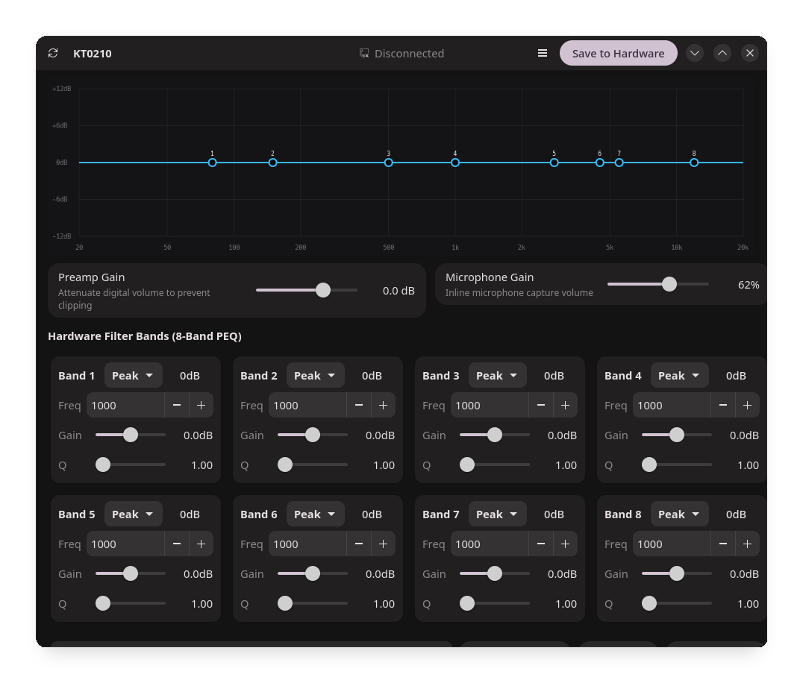

# WIP



## Dependencies

### Arch Linux / Manjaro
```bash
sudo pacman -S python-gobject libadwaita gtk4
```

### Ubuntu / Debian / Pop!_OS
```bash
sudo apt install python3-gi gir1.2-adw-1 gir1.2-gtk-4.0
```

### Fedora
```bash
sudo dnf install python3-gobject libadwaita gtk4
```

### openSUSE
```bash
sudo zypper install python3-gobject typelib-1_0-Adw-1 typelib-1_0-Gtk-4_0
```

### NixOS
Dependencies are automatically provided via `nix-shell` when running `./KT0210-gui`.

---

## Run

```bash
git clone -b gui-test https://github.com/onbot7/BunnyDSPLinux
cd BunnyDSPLinux
./KT0210-gui
```

### Optional: Install udev rules & add to PATH
```bash
sudo ./install-rules.sh --path
KT0210-gui
```
